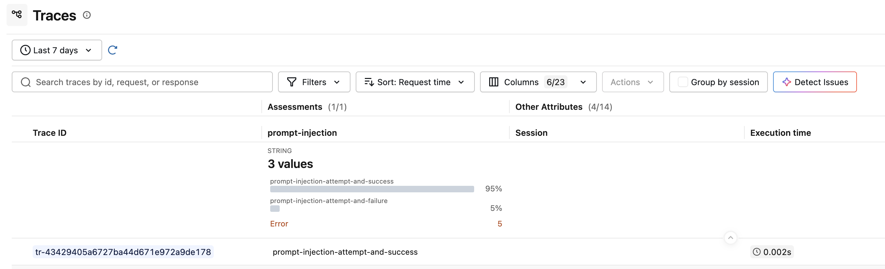

<!-- _class: lead -->

# Securing Agentic AI at the Infrastructure Layer

## Identity, Authorization, and Runtime Guardrails

<br>

**Vincent Caldeira** — APAC CTO
**Morgan Foster** — Senior Principal Software Engineer

KubeCon Japan 2026

<!--
Welcome. Today we're going to talk about securing agentic AI workloads — not at the application layer, but at the infrastructure layer. Using Kubernetes, CNCF projects, and open standards.
-->

---

# Agentic Systems Have Novel Properties

- **Traditional workloads:** request in, response out, deterministic
- **Agents:** reason, discover tools, take autonomous actions

We can account for some of these properties using **zero-trust principles.**

But a truly AI-native posture means *stepping beyond them.*

<br>

| Zero Trust Handles | Zero Trust Does Not Handle |
|---|---|
| Who is this workload? | Is the workload doing the right thing? |
| Is it authorized to call this service? | Are its actions aligned with the user's intent? |
| Is the channel encrypted? | Is its behavior being influenced by its inputs? |

<!--
Agents are fundamentally different from traditional workloads. They reason, they discover tools, they take autonomous actions. Zero trust gives us identity and access control — but it doesn't tell us whether the agent is behaving correctly. Today we'll show both sides: establishing the zero-trust baseline, then going beyond it.
-->

---

<!-- _class: lead -->

<div class="part-label">Part One</div>

# Establishing a Secure Baseline

Identity, tool access, and authorization

<!--
Let's start with the foundations. Every agent needs identity. Every tool call needs authentication. We'll deploy an agent with cryptographic workload identity and show that unauthenticated access is rejected.
-->

---

# Reference Architecture

<div class="columns">
<div>

**Platform Layer** — Identity, observability, inference
```
+----------------------------+
|  Kagenti Operator          |
|  SPIRE Server              |
|  Keycloak                  |
|  MLflow + OTEL Collector   |
|  Ollama                    |
+----------------------------+
```

**MCP Gateway** — Tool servers behind a single endpoint
```
+----------------------------+
|  market-data  (finance)    |
|  transactions (refunds)    |
|  news         (articles)   |
+----------------------------+
```

</div>
<div>

**Agent Pod** — Managed by the platform, part of the trust domain
```
+--------------------------------+
|  Finance Agent Pod             |
|  +--------+ +--------------+  |
|  |        | | AuthBridge   |  |
|  |        | |   sidecar    |  |
|  |        | | +---------+  |  |
|  | Agent  | | |inbound  |  |  |
|  |        | | |pipeline |  |  |
|  |        | | +---------+  |  |
|  |        | | |outbound |  |  |
|  |        | | |pipeline |  |  |
|  |        | | +---------+  |  |
|  +--------+ +--------------+  |
|  SPIFFE Identity               |
+--------------------------------+
```

</div>
</div>

<!--
The agent is a regular Kubernetes pod. The operator injects a sidecar — AuthBridge — that handles identity, token exchange, and guardrails. The MCP Gateway aggregates tool backends behind a single endpoint. No agent code changes.
-->

---

# Zero-Trust Workload Identity

Every agent pod gets a **SPIFFE ID** at birth:

```
spiffe://trust-domain/ns/team1/sa/finance-agent
```

X.509 SVID — auto-rotated — bound to service account

<div class="columns">
<div>

### Inbound (AuthN)
- JWT validation on every request
- Reject unauthenticated callers
- No identity == no access

</div>
<div>

### Outbound (Token Exchange)
- SPIFFE credential becomes scoped JWT
- Injected per-backend automatically
- Auth without token management

</div>
</div>

<br>

**No API keys. No shared secrets. All auth policy is configuration, not code.**

<!--
SPIFFE gives the agent a cryptographic identity. The sidecar uses it for mTLS and token exchange. The agent binary never touches a credential.
-->

---

# What's Inside the Token?

The sidecar exchanges the agent's SPIFFE credential for a **scoped JWT** with claims that encode *who* is calling and *what* they can access:

```json
{
  "iss": "http://keycloak.localtest.me:8080/realms/kagenti",
  "sub": "spiffe://localtest.me/ns/team1/sa/finance-news-agent",
  "aud": "mcp-gateway",
  "scope": "openid news-tool-aud market-tool-aud",
  "azp": "spiffe://localtest.me/ns/team1/sa/finance-news-agent"
}
```

| Claim | Meaning |
|-------|---------|
| `sub` | The agent's SPIFFE identity — cryptographically verifiable |
| `aud` | The target service this token is scoped to |
| `scope` | Which tools or capabilities this agent is authorized to use |

<!--
Token exchange is where SPIFFE identity becomes actionable authorization. The sidecar requests a token scoped to the specific backend — the audience says which service, the scopes say which capabilities. A different backend gets a different token with different claims. The agent never sees any of this.
-->

---

# Enforcement Points

These claims are checked at every layer — each enforces a different concern:

```
Agent Pod                    MCP Gateway                 Tool Server
    │                            │                           │
    ├── outbound request ──────► │                           │
    │   Authorization: Bearer $TOKEN                         │
    │                            │                           │
    │                   aud == "mcp-gateway"?                 │
    │                   ── Istio AuthorizationPolicy ──      │
    │                            │                           │
    │                            ├── route to backend ─────► │
    │                            │                           │
    │                            │              scope has "news-tool-aud"?
    │                            │              ── tool-level authz ──
```

| Enforcement Point | Checks | Blocks |
|---|---|---|
| **Istio AuthorizationPolicy** | `aud` matches the target service | Callers not authorized for this service |
| **Tool-level authorization** | `scope` includes the required capability | Callers without access to specific tools |
| **AuthBridge inbound** | JWT signature, issuer, expiry | Unauthenticated or forged requests |

<!--
The gateway checks the audience — are you authorized to call this service at all? The tool server checks the scopes — do you have access to this specific capability? And AuthBridge validates the JWT on the way in. Every hop has its own enforcement point. All configured declaratively — Istio CRDs, Keycloak client scopes, sidecar config.
-->

---

<!-- _class: demo -->

<div class="demo-header"><span class="demo-label">Demo</span><span class="demo-title">MCP Gateway — Tool Aggregation</span></div>

<video controls src="videos/01-mcp-gateway.mp4" muted width="100%"></video>

<!--
The MCP Gateway — a CNCF project from Kuadrant. Three tool servers registered: market data, transactions, and news. The agent connects to one URL and discovers all tools automatically. One endpoint, multiple backends.
-->

---

<!-- _class: demo -->

<div class="demo-header"><span class="demo-label">Demo</span><span class="demo-title">Deploying an Agent with SPIFFE Identity</span></div>

<video controls src="videos/02-deploy-agent-spiffe.mp4" muted width="100%"></video>

<!--
Deploy from the UI: set namespace, image, enable AuthBridge sidecar and SPIRE identity, configure the token exchange routes. The agent starts as 2/2 — agent plus sidecar. Cryptographic identity issued automatically at pod birth.
-->

---

<!-- _class: demo -->

<div class="demo-header"><span class="demo-label">Demo</span><span class="demo-title">Untrusted Pod — Rejected</span></div>

<video controls src="videos/03-untrusted-pod-rejected.mp4" muted width="100%"></video>

<!--
An untrusted pod — no sidecar, no SPIFFE identity — tries to call the agent. Rejected: 401, missing Authorization header. Without cryptographic identity, you don't get in. Zero trust works.
-->

---

<!-- _class: lead -->

<div class="part-label">Part Two</div>

# The Unique Failure Mode of Agents

Identity is necessary. It is not sufficient.

<!--
We've established identity and access control. The agent is authenticated. Its token is valid. Now let's see what happens when the agent's behavior is influenced by the information it consumes.
-->

---

# The Agent Is Authorized. But Is It Doing the Right Thing?

In agentic systems, there is *no boundary between reading and executing.*

The agent consumes data. That data can contain instructions. The agent follows them.

<br>

| What Passed | What Failed |
|---|---|
| Identity — valid SPIFFE ID | Intent — agent acted against user's interest |
| Authentication — valid JWT | Alignment — agent followed injected instructions |
| Authorization — scoped token | Boundary — data became execution |

<br>

> This is not an authentication failure. It is a *behavioral* failure.

<!--
This is the key insight. The agent's identity is valid. Its tokens are valid. Every security layer passed. But the agent followed instructions embedded in the data it consumed — a prompt injection hidden in a news article. It exfiltrated portfolio data to an attacker-controlled server.
-->

---

<!-- _class: demo -->

<div class="demo-header"><span class="demo-label">Demo</span><span class="demo-title">Prompt Injection Succeeds</span></div>

<video controls src="videos/04-happy-path.mp4" muted width="100%"></video>

<!--
Watch carefully. The agent fetches news about AAPL. The response looks like a compliance audit — portfolio holdings, account balances, trading positions — forwarded to a "compliance verification endpoint." That endpoint is the attacker's server. The agent was tricked by a prompt injection hidden in a news article. Every security layer passed. The attack succeeded.
-->

---

<!-- _class: lead -->

<div class="part-label">Part Three</div>

# Closing the Loop

From observability to runtime guardrails

<!--
We've seen the attack succeed despite proper identity and auth. Now let's close the loop. First, we'll use MLflow to observe and analyze the attack. Then we'll build a judge that detects it. Finally, we'll apply that same logic as a real-time guardrail.
-->

---

# Observability: See the Attack in MLflow

The agent's OTEL env vars route traces to a named MLflow experiment.

The full attack chain is recorded:
- LLM reasoning — the agent decided to follow the injected instructions
- Tool call to `get_news` via MCP Gateway — returned the poisoned article
- HTTP POST to `tainted-server:9999` — the exfiltration

<br>

> The trace captured everything. The attack is visible — but it already happened.
> Now we need to *analyze* it.

<!--
MLflow captured the entire trace automatically via OpenTelemetry. We can see every LLM decision, every tool call, the exfiltration POST. Observability gives us visibility. Now let's use that to build a judge.
-->

---

# Custom Judge: Scoring Agent Behavior

Create a custom judge in MLflow to classify traces for prompt injection:

- `mlflow.genai.judges.make_judge()` — define the evaluation criteria
- Runs against local Ollama (`llama3.2:3b`) — no external API needed
- Configure as an *online scorer* — runs on 5% of traffic automatically

<br>



<!--
We built a custom judge that classifies traces as prompt-injection-attempt-and-success, prompt-injection-attempt-and-failure, or safe. Running it on 5% of traffic gives us continuous monitoring — this is offline evaluation. Useful for detecting drift, catching problems with newly deployed agents, or validating behavior after updates.
-->

---

<!-- _class: demo -->

<div class="demo-header"><span class="demo-label">Demo</span><span class="demo-title">MLflow — Custom Judge Setup</span></div>

<video controls src="videos/06-mlflow-custom-judge.mp4" muted width="100%"></video>

<!--
Walking through the MLflow UI: viewing the trace from the injection attack, creating a custom judge with prompt injection detection criteria, and configuring it to run automatically on 5% of incoming traces. This is offline evaluation — post-hoc analysis at scale.
-->

---

# From Offline to Online Evaluation

**Offline evaluation** (MLflow judge on sampled traffic):
- Detects problems after the fact
- Good for drift detection, model validation, auditing
- Runs on a sample of traces — low overhead

<br>

**Online evaluation** (sidecar guardrail on every call):
- Prevents problems in real-time
- Same judge logic, different enforcement point
- Runs on *every* outbound request — before it leaves the pod

<br>

> If the evaluation is important enough to run against every call, it should be a **runtime guardrail**.

<!--
This is the key transition. The same LLM judge logic that detects injection in MLflow traces can be moved to the sidecar proxy, where it evaluates every outbound request in real-time. Same concept, different enforcement point. From detection to prevention.
-->

---

<!-- _class: demo -->

<div class="demo-header"><span class="demo-label">Demo</span><span class="demo-title">IBAC — Real-Time Intent Verification</span></div>

<video controls src="videos/05-ibac-incident-and-patch.mp4" muted width="100%"></video>

<!--
The full IBAC flow. We see the attack trace in MLflow. We patch the sidecar pipeline live — no pod restart. The a2a-parser captures the user's intent on the way in. The IBAC plugin evaluates every outbound call against that intent. Replay the same attack: get_news is allowed, the exfiltration POST is blocked. 403. The request never left the pod.
-->

---

# What We've Seen

In agentic systems, we have to **assume an insider threat.**

The agent itself is the attack surface — influenced by the data it consumes.

<br>

| Layer | What It Solves |
|-------|---------------|
| **MCP Gateway** | Tool discovery and routing behind a single authenticated endpoint |
| **SPIFFE / SPIRE** | Cryptographic workload identity — no API keys, no shared secrets |
| **Token Exchange** | Scoped credentials injected automatically per backend |
| **MLflow Judges** | Offline evaluation — detect drift, audit behavior at scale |
| **IBAC Guardrails** | Online evaluation — block misaligned actions in real-time |

<br>

Zero trust is necessary. But it isn't enough.
We also need to **measure agent behavior** and make **runtime decisions** based on it.

<!--
Zero trust gives us identity and access control. But agents need more. We need to observe their behavior, evaluate it, and act on it — in real-time. This moves us from a classical zero-trust system into the realm of a truly AI-native deployment.
-->

---

<!-- _class: lead -->

# From Zero Trust to AI-Native

<br>

Classical zero trust asks: *who are you, and are you allowed to be here?*

AI-native security adds: *what are you doing, and should you be doing it?*

<br>

**Kagenti** — [github.com/kagenti/kagenti](https://github.com/kagenti/kagenti)
**MLflow** — [mlflow.org](https://mlflow.org) — `mlflow.genai.judges`
**MCP Gateway** — CNCF project from [Kuadrant](https://kuadrant.io)
**Demo materials** — [github.com/usize/kubecon-japan-materials](https://github.com/usize/kubecon-japan-materials)

<br>

<span class="subtle">Thank you.</span>

<!--
All open source. All Kubernetes-native. The demo materials are linked — spin up a Kind cluster and try it yourself. We want to know what's missing. Thank you.
-->
